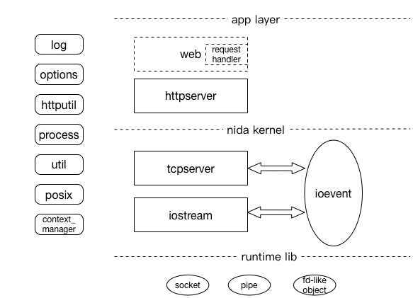
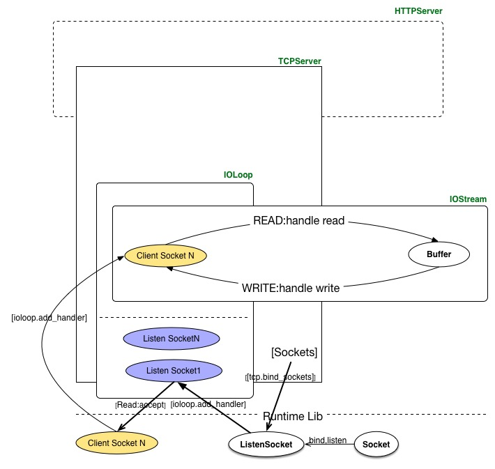
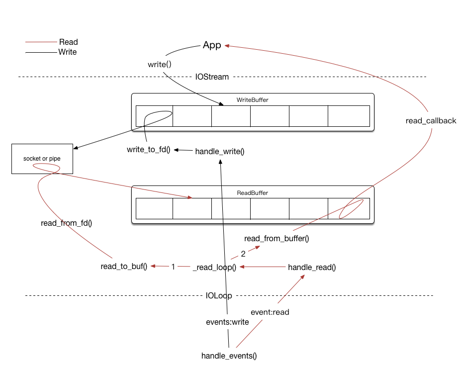

## Nida简介
Nida是一个单线程多进程，非阻塞异步回调，基于Level-Trigger事件循环驱动的高并发后台框架，使用Python语言开发，基于Tornado[^1]改写。简化并去掉了Tornado一些复杂的特性，方便大家阅读与学习核心源码。
---- ----
一个使用Nida搭建的简单echo HTTP服务的例子如code1所示：
	code.1
	def handle_request(request):
	    message = "You requested %s\n" % request.uri
	    request.write("HTTP/1.1 200 OK\r\nContent-Length: %d\r\n\r\n%s" % (
	          		len(message), message))
	    request.finish()
	
	parse_command()
	http_server = nida.httpserver.HTTPServer(handle_request)
	http_server.listen(8080)
	nida.ioevent.IOLoop.instance().start()

在这个例子中，HTTPServer注册一个callback函数`handle_request`，当HTTP请求的Header与Body部分异步解析完毕后再由HTTPServer异步回调此函数，并将解析过的请求对象传给它。而所有的异步回调机制都由其下层的模块实现，对上层透明。

图1.Nida架构图
- runtime lib: 由Python的runtime库函数提供
	主要用到了网络编程相关的socket, pipe等模块。
- nida kernel：Nida的核心层。
	- ioevent模块是循环事件的核心，提供基于epoll Level-Trigger模式的I/O多路复用事件监听。
	- iostream模块提供对fd-like的I/O数据流Buffer封装和读写实现。
	- tcpserver负责地址监听并将建立新的连接加入到事件循环。
- app layer：Nida的应用层，主要负责HTTP协议的解析及响应。
	- httpserver是tcpserver的一个上层实现，完成了对HTTP 请求Headers及Body的解析。
	- web尚未实现，负责Request到Handler的分发。
- 周边：辅助模块。
	- httputil：辅助HTTP协议的解析。
	- util：数据类型，编码等
	- log：日志模块。
	- options：命令行解析及参数定义模块。
	- posix：针对posix系统的一些系统调用。
	- process：多进程支持模块。
	- context\_manager：上下文管理模块。
	- factory, singleton等。
## 从0到1构建Nida
在同步、多线程编程模型中，网络I/O过程会遇到阻塞情况，为提高并发简单的处理方式是为每一个用户连接分配一个线程去处理，这样其中一个线程的在进行阻塞型系统调用时不会影响其他线程。然而这种方式存在大量的线程上下文切换[^2]，会遇到C10K问题[^3]。
使用level-trigger模式的后台服务基于非阻塞异步回调，无需上下文切换，可在单线程上达到高并发。Nida以此为原型进行后台开发。

图2.Nida kernel工作模式
### ioevent模块
ioevent模块实现了基于epoll level-trigger模式的事件监听，提供fd-like的事件监听的添加、修改及删除，以及callback函数的添加。通过start进行事件循环处理，通过stop停止循环。一个简单的TCPServer代码片段如code2：
	code.2
	sock = socket.socket(socket.AF_INET,socket.SOCK_STREAM,0)
	sock.setblocking(0)
	sock.bind(("",port))
	sock.listen(128)
	 
	io_loop = nida.ioevent.IOLoop.current()
	io_loop.add_handler(sock.fileno(),callback,io_loop.READ)
	io_loop.start()
### iostream模块
iostream模块提供了对fd-like(包括socekt, pipe)的I/O数据流的读写操作和缓存。iostream将自己注册在IOLoop中进行读写监听，并将读写的数据缓存在Buffer中供上层使用。上层在iostream中的读写操作中注册回调函数，在iotream完成读写操作时异步调用回调函数。

图3.iostream工作模式
一个使用Demo：
	code.3
	def send_request():
	    stream.write(b"GET / HTTP/1.0\r\nHost: friendfeed.com\r\n\r\n")
	    stream.read_until(b"\r\n\r\n", on_headers)
	
	def on_headers(data):
	    headers = {}
	    for line in data.split(b"\r\n"):
	        parts = line.split(b":")
	        if len(parts) == 2:
	            headers[parts[0].strip()] = parts[1].strip()
	    stream.read_bytes(int(headers[b"Content-Length"]), on_body)
	
	def on_body(data):
	    print(data)
	    stream.close()
	    nida.ioevent.IOLoop.current().stop()
	
	if __name__ == '__main__':
	    s = socket.socket(socket.AF_INET, socket.SOCK_STREAM, 0)
	    stream = nida.iostream.IOStream(s)
	    stream.connect(("friendfeed.com", 80), send_request)
	    nida.ioevent.IOLoop.current().start()
### tcpserver
tcpserver基于iostream和ioloop实现，将监听socket加入到ioloop事件循环进行监听并注册处理器，当ioloop监听到新的连接时将其交给处理器，处理器将新的连接封装到iostream中进行读写操作。tcpserver暴露其iostream处理接口，由上层协议对数据进行解析。tcpserver处理TCP事务代码如code4。
	code.4
	def _handle_conn(self, conn, addr):
	    try:
	        stream = IOStream(conn)
	        self.handle_stream(stream, addr)
	    except:
	        app_log.error("error in handle connection", exc_info = True)
	
	def handle_stream(self, stream, addr):
	    raise NotImplementedError()
	
	#listen或bind时调用
	def accept_connection(self, sock, callback):
	    def accept_handler(fd, events):
	        while True:
	            try:
	                conn, addr = sock.accept()
	            except socket.error as e:
	                if e.args[0] in (errno.EWOULDBLOCK, errno.EAGAIN):
	                    return
	                raise
	            callback(conn, addr)
	
	    self.ioloop.add_handler(sock, accept_handler,
	                            self.ioloop.READ)
### httpserver
httpserver是tcpserver的一个子类，并实现了tcpserver的数据处理接口`handle_stream`用来解析HTTP 协议请求，并将解析后的结果交给web模块，由web模块根据策略进行handler分发（例如根据请求的path）。Demo见code1.
### 周边模块
此外，在开发过程中会需要一些周报模块进行辅助，例如：
- context\_manager模块负责管理异步回调的上下文。在异步环境中，当回调函数执行时已经脱离了被调用时的上下文，回调函数的异常不能影响调用函数的表现，这样在HTTP层如果遇到callback问题并不能准确的返回错误码。context\_manager模块可以解决此问题。
- options模块负责解析命令行参数，并且开放自定义命令行参数的接口。
- log模块负责打印日志，使用options来自定义自己的命令行参数，例如分割日志模式，日志路径等。
### 后续
- Application层需要进一步完善，完成Web和RequestHandler等相关开发，预期Demo如code5：
	code.5
	class MainHandler(RequestHandler):
	    def get(self):
	    self.write("Hello, world")
	
	if __name__ == "__main__":
	    application = Application([
	          (r"/", MainHandler),
	    ])
	    application.listen(8080)
	    nida.ioevent.IOLoop.instance().start()
- RPC
	基于Nida Kernel开发直接远程方法调用以及自定义协议通信。

[^1]:	[https://github.com/tornadoweb/tornado](https://github.com/tornadoweb/tornado)

[^2]:	[https://en.wikipedia.org/wiki/Context\_switch](https://en.wikipedia.org/wiki/Context_switch)

[^3]:	[http://scotdoyle.com/python-epoll-howto.html](http://scotdoyle.com/python-epoll-howto.html)
